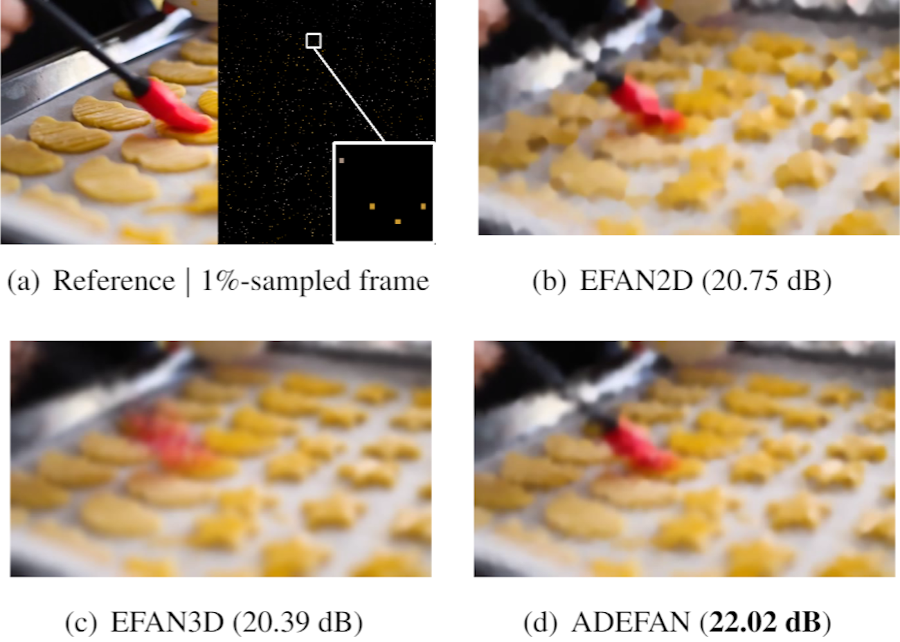

# Divergence-Based Adaptive Extreme Video Completion (ICASSP 2020)

**Mirror repository; maintained up-to-date version at: [https://github.com/majedelhelou/ADEFAN](https://github.com/majedelhelou/ADEFAN)**

[Majed El Helou](http://majedelhelou.github.io), Ruofan Zhou, Frank Schmutz, Fabrice Guibert and Sabine Süsstrunk

[**Paper**](http://infoscience.epfl.ch/record/277003/)  ---  [**Dataset**](https://ieee-dataport.org/documents/extreme-video-completion-dataset)

This repository contains the neeeded files to reproduce all results presented in the paper. 

Credits to Frank Schmutz for the current implementation.

> **Abstract:** *Extreme image or video completion, where, for instance, we only retain 1% of pixels in random locations, allows for very cheap sampling in terms of the required pre-processing. The consequence is, however, a reconstruction that is challenging for humans and inpainting algorithms alike. 
We propose an extension of a state-of-the-art extreme image completion algorithm to extreme video completion. We analyze a color-motion estimation approach based on color KL-divergence that is suitable for extremely sparse scenarios. Our algorithm leverages the estimate to adapt between its spatial and temporal filtering when reconstructing the sparse randomly-sampled video, we call it **A**daptive **D**epth **E**fficient **F**iltering by **A**daptive **N**ormalization (ADEFAN). We validate our results on 50 publicly-available videos using reconstruction PSNR and mean opinion scores.*



### 1. Dependencies
* Numpy
* Scipy
* Matplotlib
* OpenCV for Python
* [HDF5 for Python](http://www.h5py.org/)


### 2. To reproduce KL divergence results (Fig 2)
Open the ExtremeVideoCompletion notebook and run all the cells in the "Source Code" and "Compression" sections. You can then generate the results by running the all the cells in the "KL Divergence plot" subsection (located in the "Plots" section). You can specify the directories where you put your input videos and where you want the videos compressed in the cell running the "generate_kl_divergence_samples" function. Alternatively you can use the same directory structure as specified in section 5 of this readme.

### 3. To reproduce evaluation results (Fig 3, 4)
Open the ExtremeVideoCompletion notebook and run all the cells in the "Source Code", "Compression" and "Reconstruction and PSNR score" sections. Note that you need to use the same directories as specified in section 5 of this readme if you don't want to modify all the paths in the code.

### 4. To compare with MPEG-4
To compare with MPEG-4 compression, you can simply run the following command:
```
ffmpeg -i {input_file_path} -vcodec libx265 -crf 51 {output_file_path}
```
This will give you a MPEG-compressed video with bitrate of slightly higher than the bitrate of the 2%-sampled videos.

### 5. To test on your own input video
To test on your own input videos without any code modification, you need to have the following directories already created:
../Resources/Videos/  
../Results/Grids/  
../Results/Frames/  
../Results/CompressedVideos/1percent/  
... same as above for [1-8]percent  
../Results/ReconstructedVideos/1percent/EFAN2D/  
../Results/ReconstructedVideos/1percent/EFAN3D/  
../Results/ReconstructedVideos/1percent/ADEFAN/  
... same as above for [1-8]percent

You can automatically create this directory structure by running the generate_paths [.sh for Linux/Mac or .bat for Windows] script from the location of the repository.

Finally you need to put your input videos in the ../Resources/Videos/ directory.

### Citation

    @inproceedings{elhelou2020divergence,
        title={Divergence-Based Adaptive Extreme Video Completion},
        author={El Helou, Majed and Zhou, Ruofan and Schmutz, Frank and Guibert, Fabrice and S{\"u}sstrunk, Sabine},
        booktitle={ICASSP},
        year={2020}
    }
