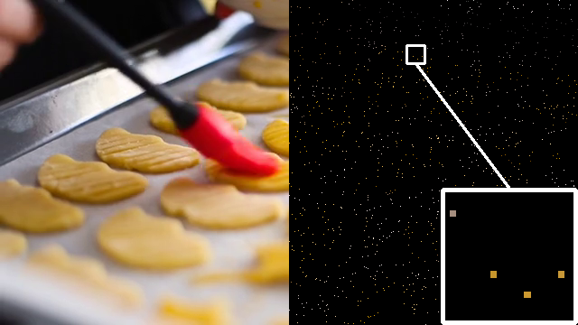
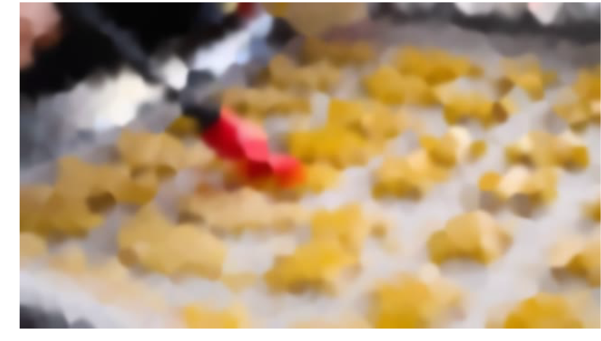
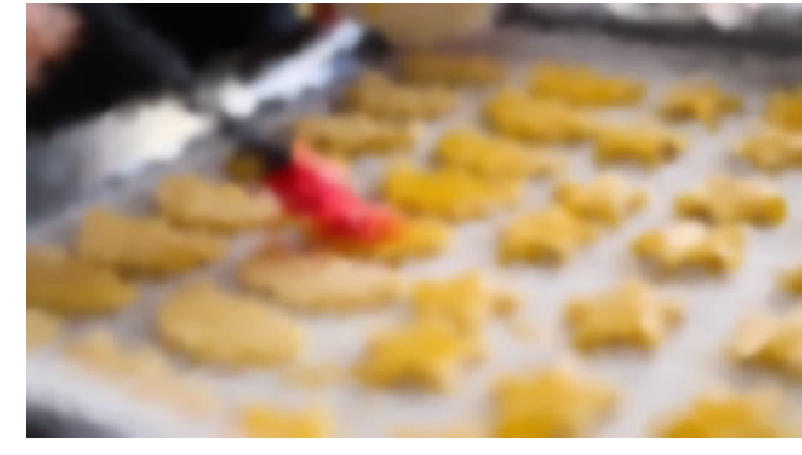

# ADEFAN

This repository contains the neeeded files to reproduce all results presented in the paper:

**[Divergence-Based Adaptive Extreme Video Completion](add link)**

[Majed El Helou](http://majedelhelou.github.io), Ruofan Zhou, Frank Schmutz, Fabrice Guibert, Sabine Süsstrunk

We present an adaptive method, based on color-KL sparse estimation, to reconstruct videos from pixels sampled at extremely low rates (for example 1% of all pixels), and sampled at random locations. **A**daptive **D**epth **E**fficient **F**iltering by **A**daptive **N**ormalization (ADEFAN) is thus aimed at extreme video completion from random pixels. It is also an extremely efficient compression method in terms of pre-processing, while outperforming even MPEG compression at extremely high compression rates. It also provides indirect encryption because a key must be shared to identify the locations of the randomly-sampled pixels.

### 1. Dependencies
* Numpy
* Scipy
* Matplotlib
* OpenCV for Python
* [HDF5 for Python](http://www.h5py.org/)

### 2. To reproduce KL divergence results (Fig 2)
Open the ExtremeVideoCompletion notebook and run all the cells in the "Source Code" and "Compression" sections. You can then generate the results by running the all the cells in the "KL Divergence plot" subsection (located in the "Plots" section). You can specify the directories where you put your input videos and where you want the videos compressed in the cell running the "generate_kl_divergence_samples" function. Alternatively you can use the same directory structure as specified in section 5 of this readme.

### 3. To reproduce evaluation results (Fig 3, 4)
Open the ExtremeVideoCompletion notebook and run all the cells in the "Source Code", "Compression" and "Reconstruction and PSNR score" sections. Note that you need to use the same directories as specified in section 5 of this readme if you don't want to modify all the paths in the code.

### 4. To compare with MPEG-4
...

### 5. To test on your own input video
To test on your own input videos without any code modification, you need to have the following directories already created:
../Resources/Videos/
../Results/Grids/
../Results/Frames/
../Results/CompressedVideos/1percent/
... same as above for [1-8]percent
../Results/ReconstructedVideos/1percent/EFAN2D/
../Results/ReconstructedVideos/1percent/EFAN3D/
../Results/ReconstructedVideos/1percent/ADEFAN/
... same as above for [1-8]percent

You can automatically create this directory structure by running the generate_paths [.sh for Linux/Mac or .bat for Windows] script from the location of the repository.

Finally you need to put your input videos in the ../Resources/Videos/ directory.
